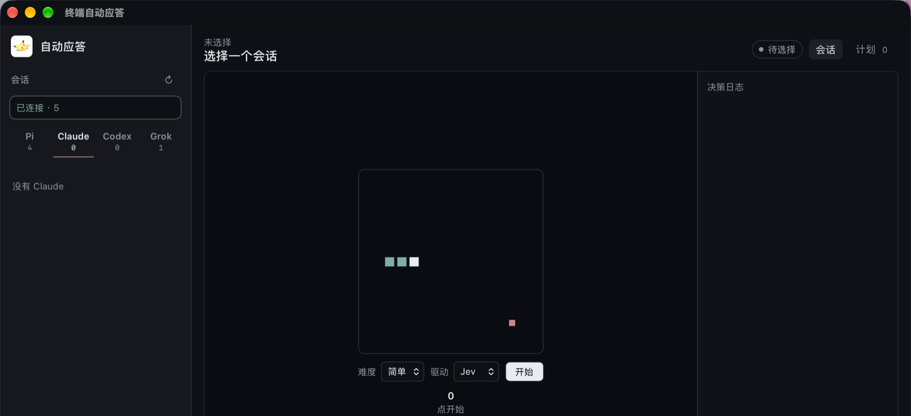
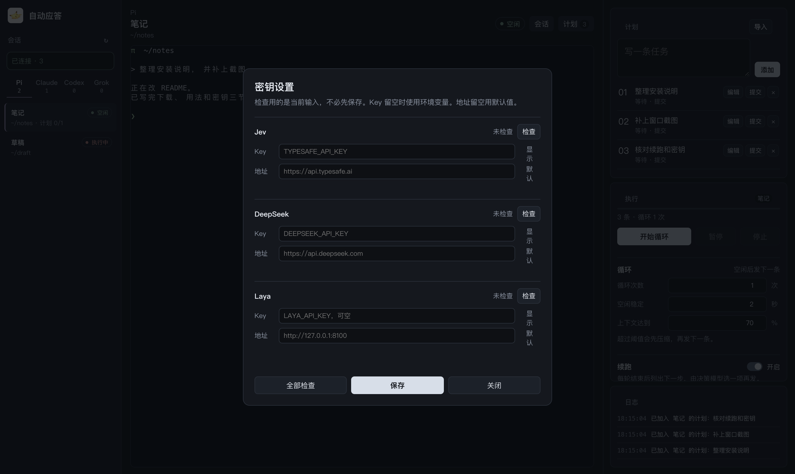
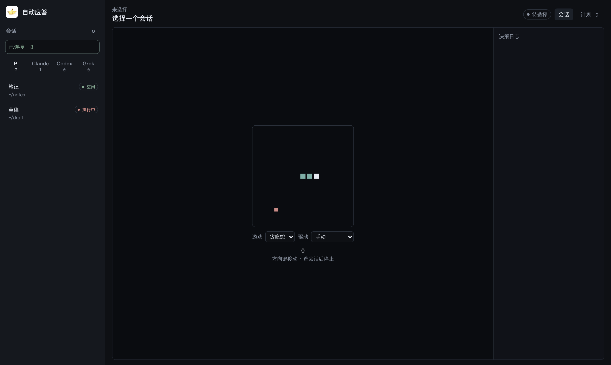
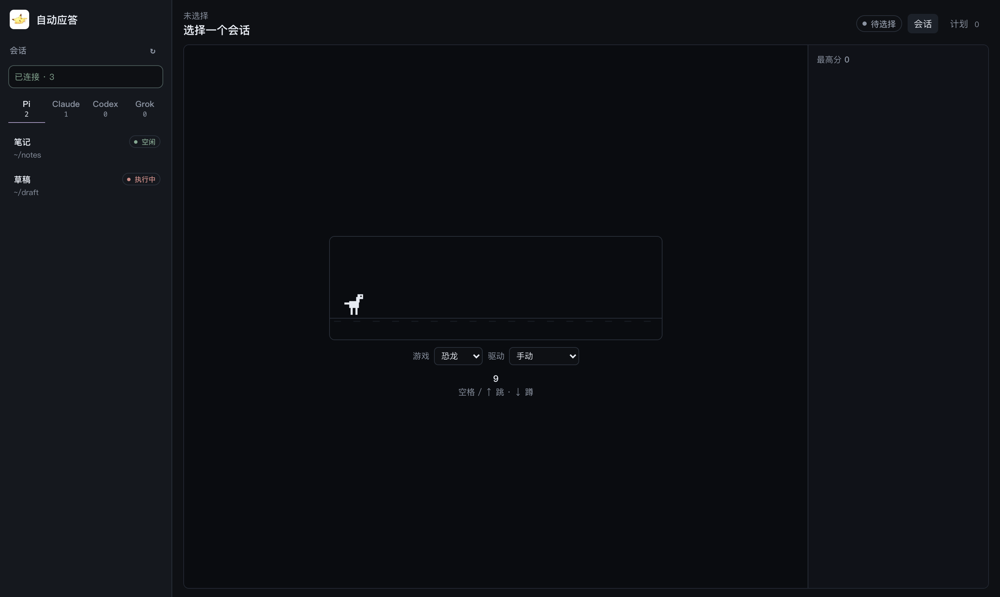

# herdr+

herdr+ 是跑在 [Herdr](https://github.com/herdrdev/herdr) 上面的一层。Herdr 负责窗口、pane、agent 和终端本身；herdr+ 只通过 Herdr 的接口读状态、接实时终端、发下一轮。没有 Herdr，这个应用打不开任何会话。

项目主页：<https://uasier.github.io/pi-auto/>



## 底层是 Herdr

herdr+ 不自己起终端，也不自己识别 Pi / Claude / Codex / Grok。

- 会话列表来自 Herdr 的 pane。标题用 Herdr 窗口名，不用 `w1:p2`。
- 中间的终端是接上 Herdr 的客户端套接字，看到的是 Herdr 正在画的那一屏。滚轮走的是 Herdr 的历史，不是往 pane 里塞翻页键。
- 「终端」按钮调用 Herdr 新建窗口。目录从已有会话或系统选择器来。
- 菜单里的主题就是 Herdr 的内置主题。切换会写入 Herdr 的 `config.toml`，并让 Herdr 重新加载，所以 Herdr 自己的终端配色一起变。
- 空闲、工作中、卡住，看的是 Herdr 报上来的 agent 状态和终端输出。

本机需要先有 `~/.config/herdr/herdr.sock`。普通 VS Code 终端或 Terminal.app 接不进来。

## 下载

从 [GitHub Releases](https://github.com/uasier/pi-auto/releases) 安装。仓库名和安装包文件名仍是 `pi-auto`，安装后的应用是 **herdr+**。

- macOS Apple Silicon：`pi-auto_*_aarch64.dmg`
- macOS Intel：`pi-auto_*_x64.dmg`

安装包未签名。拖进「应用程序」后，若提示已损坏，执行：

```bash
xattr -dr com.apple.quarantine "/Applications/herdr+.app"
```

右键打开清不掉这个标记。菜单「检查更新…」对照 `uasier/pi-auto` 的最新 tag。fork 后改 `src-tauri/src/update.rs` 的 `DEFAULT_REPO`，或设置 `PI_AUTO_GITHUB_REPO`。

## 怎么用

左边选会话，中间看终端，右边先排计划，再设执行。

1. 启动 Herdr，在 pane 里打开 Pi、Claude、Codex 或 Grok。
2. 在 herdr+ 里选这个会话。
3. 在「计划」里写任务，或导入文本。待执行的可以改；正在执行、提交中、已完成的不能改。
4. 在「执行」里设循环、续跑和提交，再点「开始循环」。

- **计划**：只属于当前窗口。换会话不会把任务带走。
- **循环**：空闲稳定后发下一条。可设次数、空闲秒数和上下文百分比。超过阈值会先发压缩。
- **卡住**：循环中若 5 分钟内终端变化不到 1%，且不是 idle，会输入「继续」。
- **续跑**：每轮结束后列出下一步，由 Jev、DeepSeek 或 Laya 选一项再发。置信不够或选择停止就停。
- **提交**：任务和续跑都结束后，单独再发一轮 `git commit`。不 push。

## 终端

选中 pane 后可以直接输入。接入失败或断开只记一条错误，不会退回旧的文本预览。中文按 UTF-8 显示。

## 密钥和快捷键

- **密钥设置…** ⌘ ,。Jev、DeepSeek、Laya 各自填 Key 和地址。检查用当前输入，不必先保存。
- **系统 → 管理快捷键…**。开关双击 Tab 补全、双击 Shift 追加预置文本、⌘⇧O 优化输入。预置文本也在这里写。
- **主题**。主菜单里选 Herdr 主题。浅色主题名字后面有「浅色」。



| 决策 | 默认地址 | 环境变量 |
| --- | --- | --- |
| Jev | `https://api.typesafe.ai` | `TYPESAFE_API_KEY` |
| DeepSeek | `https://api.deepseek.com` | `DEEPSEEK_API_KEY` |
| Laya | `http://127.0.0.1:8100` | `LAYA_API_KEY`（可空）、`LAYA_BASE_URL` |

只填域名即可。Laya 需要本机提供 `/health` 和 `/v1/systemone`。同一时间只发一个 Laya 决策。

## 没选会话时

中间可以在贪吃蛇和恐龙之间切换。两种游戏的驱动分开记。

贪吃蛇可手动，或交给 Jev / Laya。收到决策才走。蛇头碰到墙或任意一节身体都算失败。

恐龙可手动，或交给 Laya。交给 Laya 时不暂停，按实时距离决定跑、跳或蹲。没有 Jev。

| 贪吃蛇 | 恐龙 |
| --- | --- |
|  |  |

## 菜单

- **herdr+**：密钥、主题、检查更新、新建窗口、关闭窗口、退出
- **系统**：管理快捷键
- **说明**：优化对话 ⌘⇧O，使用说明 ⌘ /

⌘ N 每个窗口各自选会话。关掉最后一个窗口会退出，不留在后台。

## 开发

```bash
npm install
npm test
npm run test:rust
npm run tauri dev
```

打包：

```bash
npm run tauri:build:mac
```

产物在仓库根目录的 [`release/`](./release/)。

`package.json`、`src-tauri/tauri.conf.json`、`src-tauri/Cargo.toml` 和对应 lock 的版本号必须一致。

```bash
npm run version:check
npm run version:set -- 0.2.8
npm run release:tag -- 0.2.8
git push origin HEAD && git push origin v0.2.8
```

推送 `v*` tag 后，GitHub Actions 会在 macOS arm64 / x64 构建并上传 Release。安装包文件名仍是 `pi-auto_[version]_[arch].dmg`。

## 注意

- 源码目录和 Git 仓库仍叫 `pi-auto`。产品名是 herdr+。
- Herdr 要先运行。上下文压缩依赖终端里能读到的百分比。
- Laya 不要并发打。

## 许可证

[MIT License](LICENSE)
