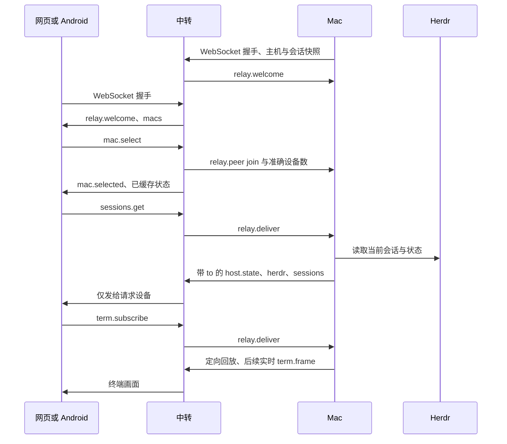

# 通信协议与恢复

Mac 主动建立到中转的 WebSocket。网页和 Android 使用各自 GitHub 登录会话加入账号房间，选择 Mac 后才接收它的状态与终端画面。Herdr 的本地 Unix socket 只由 Mac 访问。

## 消息约定

JSON 字段顺序与空格不影响解析。客户端标识来自 `relay.welcome.self`；中转内部使用连接对象区分同一标识的新旧连接。

| 消息 | 方向 | 关键字段与行为 |
| --- | --- | --- |
| `mac.select` / `mac.leave` | 设备→中转 | `id` 为 Mac 标识；切换时通知旧主机离开、新主机加入；重复选择仅重新同步状态 |
| `relay.peer` | 中转→Mac | `role=device`、`event=join/leave`、`id`、`devices`；离开时释放该设备全部订阅 |
| `sessions.get` | 设备→Mac | 经 `relay.deliver` 转发，定向返回 `host.state`、`herdr`、`sessions`；没有会话也返回空 `items` |
| `sessions` | Mac→设备 | `items` 的字段为 `paneId`、`agentLabel`、`agentState` 等 camelCase；变化时发送，另外每 15 秒刷新 |
| `term.subscribe` / `term.unsubscribe` | 设备→Mac | `paneId`；按设备和 pane 幂等计数，未持有订阅的设备退订不影响其他设备 |
| `term.frame` | Mac→设备 | `paneId`、`generation`、`seq`、`full`、尺寸和 Base64 `bytes`；回放带 `to` 定向，实时帧按 pane 使用 |
| `term.input` / `term.scroll` / `prompt` | 设备→Mac | 单条无效输入返回该设备的错误，不断开其他设备；断线时不缓存或自动重发输入 |
| `ping` / `pong` | 设备↔中转 | 应用消息心跳不要求已选 Mac；底层 WebSocket 另有 25 秒 Ping / 90 秒期限 |
| `channel.state` / `channel.resync` | Android→内嵌页面 | 本地桥接事件；断线禁用输入，溢出重新选择 Mac 并请求完整状态与回放 |

Mac 的定向回复在原消息中附加 `to`。中转只向仍选中该 Mac 的目标设备转发；页面和 Android 也按自己的 `self` 过滤定向消息。其他设备不会因某个设备请求回放而重复应用旧终端数据。

## 生命周期

- TLS/WebSocket 握手阶段读超时为 10 秒，完成后切换为 20ms 轮询。Mac 超过 90 秒没有收到任何中转数据则重连。
- 每轮最多发送 32 帧，再处理输入、心跳和配置变更，避免输出持续涌入时挤占收消息机会。
- `SessionSubscriptions` 在连接退出时释放全部引用；本地 attach 成功后才登记引用。
- 同一 Mac 的新连接替换旧连接后，设备重新收到 `mac.selected`，用新快照恢复原 pane；旧连接消息和注销不会影响新连接。
- 网页重连间隔从 1 秒递增，最多 20 秒；Android 的旧连接回调和重连定时器通过代次校验，状态变化串行进入主线程。
- Android 在后台也处理 Mac 选择和会话快照。回到前台时重新同步；空列表显示“暂无会话”，与等待快照区分。

## 队列和回放

中转发送队列或 Mac 转发队列拥堵时停止当前连接，让重连恢复完整状态，不能继续把缺少中间帧的 ANSI 流当作完整画面。Android 的前台/后台消息队列发生溢出时向页面发出重新同步信号。

Mac 的回放缓存最多保留 120 帧。超过上限或终端代次变化时放弃不完整历史，通过现时快照恢复；不会保留旧全帧后再跳过中间增量。没有远程订阅时，本地终端画面不进入远程发送队列。

## 本地验证

项目根目录执行 `npm test` 和 `npm run test:rust`。中转目录执行 `go test -race ./...`，验证真实 WebSocket 接入、JSON 字段顺序、缓存、切换和断线、定向回复、替换连接、并发及拥堵处理。

Android 使用 Gradle 8.9、JDK 17、SDK 34 执行 `gradle :app:testDebugUnitTest :app:assembleRelease`。`syncWeb` 自动从 `relay/static` 同步页面资源。没有连接 Android 实机时，页面的原生桥消息场景由 Node 回归测试验证，原生消息缓冲通过 JUnit 4 本地测试验证，服务通过 Kotlin 编译与源代码事件顺序审查验证；真机网络切换仍需安装后验证。

## 升级与回滚

先构建并部署中转，再升级 Mac 与 Android。中转可在 relay 目录用 `GOOS=linux GOARCH=amd64 go build -o herdr-relay .` 构建；目标架构应与服务器一致。替换 `/usr/local/bin/herdr-relay` 后重启现有 systemd 服务，保留 `/etc/herdr-relay` 和 `/var/lib/herdr-relay` 的配置与账号数据。

本次没有数据格式迁移。回滚时使用上一版本对应的中转和客户端构建产物；保留现有配置文件。GitHub 发布先创建草稿，待 Mac 两种架构与 Android 安装包全部完成后公开，避免 APK 上传时 Release 尚不存在。
